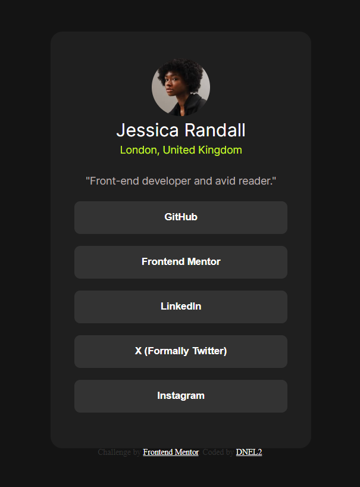

# Frontend Mentor - Social links profile solution

This is a solution to the [Social links profile challenge on Frontend Mentor](https://www.frontendmentor.io/challenges/social-links-profile-UG32l9m6dQ). Frontend Mentor challenges help you improve your coding skills by building realistic projects. 

## Table of contents

- [Overview](#overview)
  - [The challenge](#the-challenge)
  - [Screenshot](#screenshot)
  - [Links](#links)
- [My process](#my-process)
  - [Built with](#built-with)
  - [What I learned](#what-i-learned)
  - [Continued development](#continued-development)
  - [Useful resources](#useful-resources)
- [Author](#author)

## Overview

### The challenge

Users should be able to:

- See hover and focus states for all interactive elements on the page

### Screenshot

### Links

- Solution URL: (https://github.com/TechEdDan2/Social-Link-Profile)
- Live Site URL: (https://techeddan2.github.io/Social-Link-Profile/#)

## My process

As with all projects from Frontend Mentor, I use a decomposition method where I look at the provided design and then break it into the individual pieces and identify HTML elements I want to use. I then set up my css or other files and get to work. 

### Built with

- CSS custom properties
- Flexbox

### What I learned

This was a nice practice for me to see how quickly I could construct the layout that matched the design. Not sure if I learned any new techniques or processes, but it was still a nice challenge to practice my current skills. 

### Continued development

I think I should try to use a different technique to create this layout... possibly DOM or something like Bootstrap to get more practice with those tools.  

### Useful resources

- [MDN](https://developer.mozilla.org/en-US/) - As always, I used the MDN resource when I had a quick question.

## Author

- Website - [DNel2](https://github.com/TechEdDan2)
- Frontend Mentor - [@TechEdDan2](https://www.frontendmentor.io/profile/TechEdDan2)
- Twitter - [@TechEdDan](https://twitter.com/TechEdDan)

